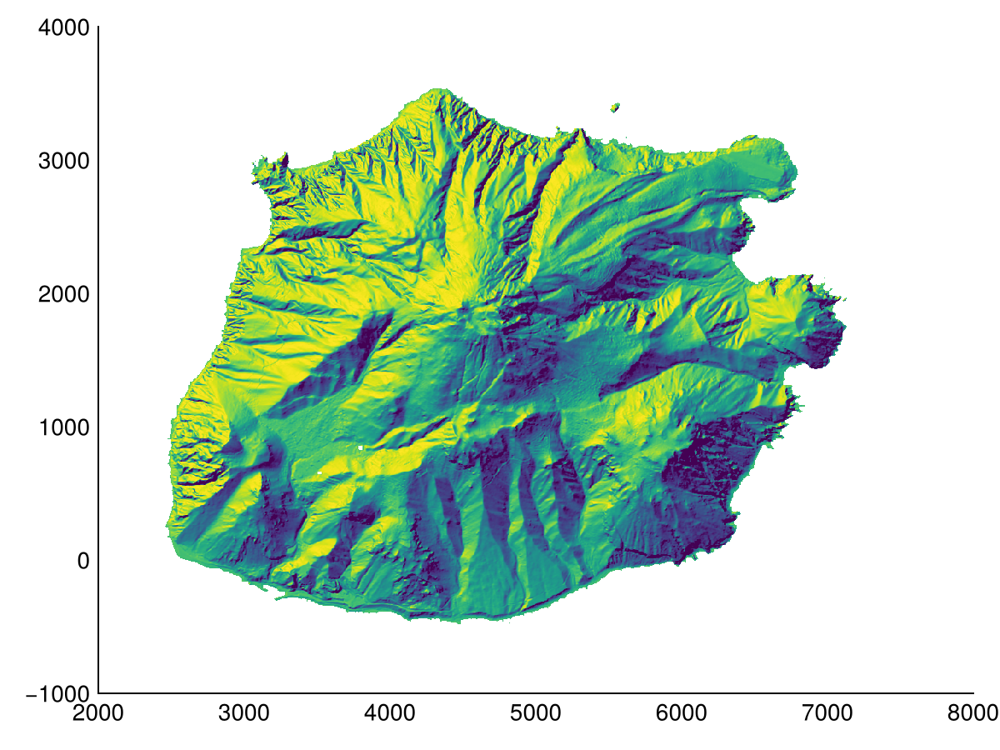
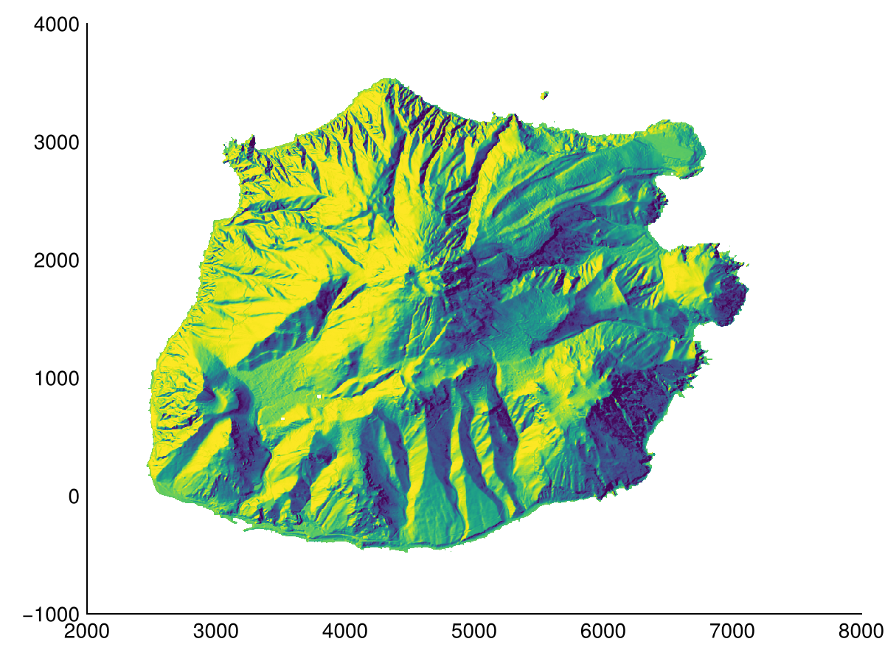
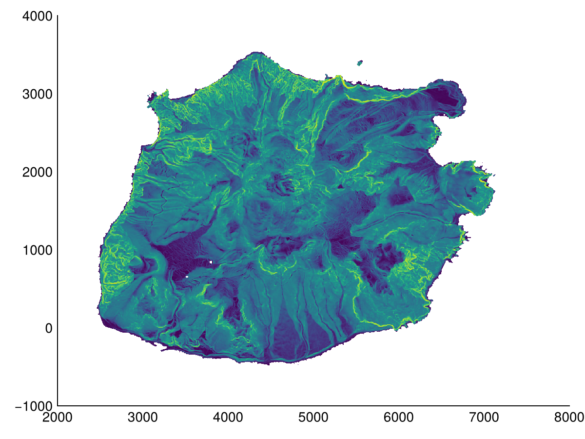
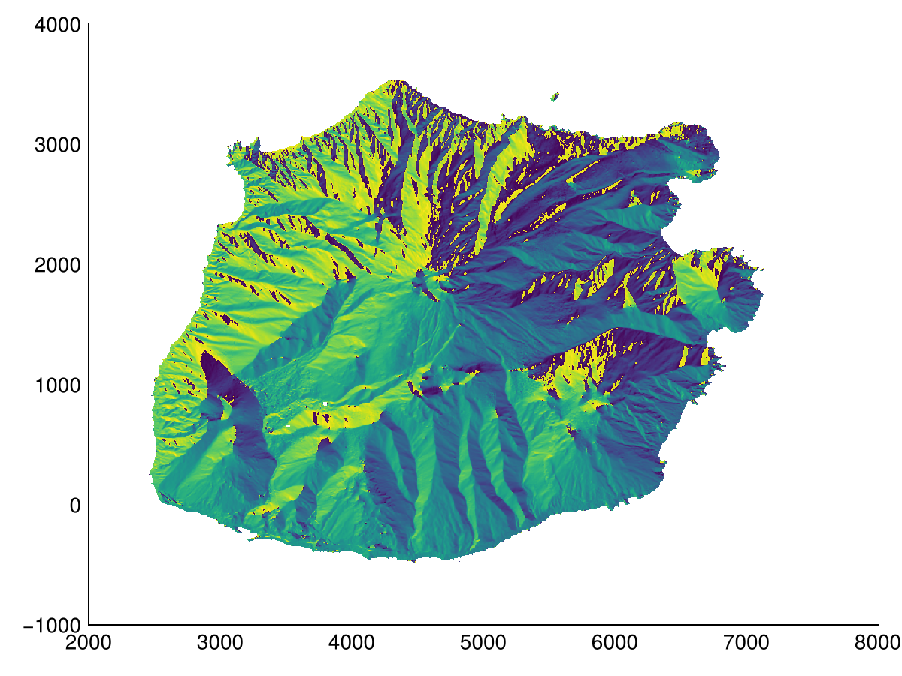
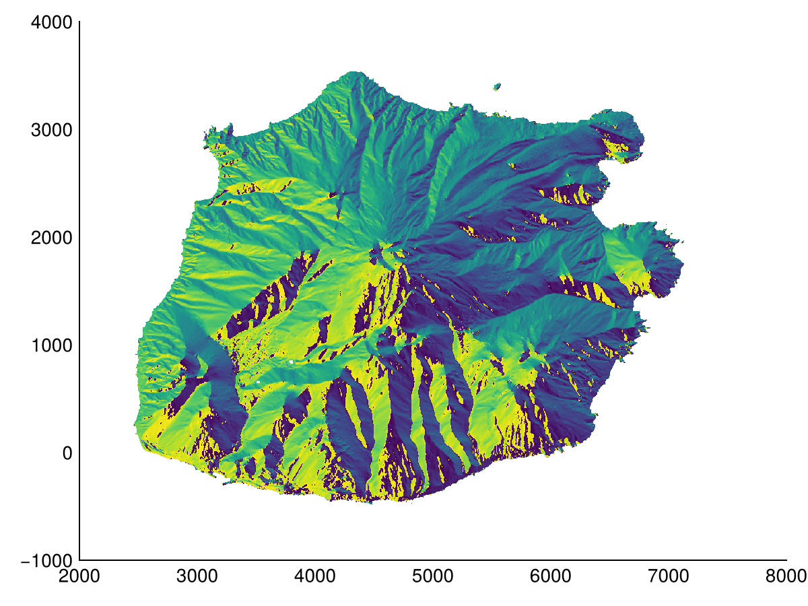

# Validation {#Validation}

This chapter compares our output with that of [gdaldem](https://gdal.org/en/stable/programs/gdaldem.html).

We test with the same elevation model as that in the [Usage](usage.md) page, and also include an upside down version of it, to ensure that the algorithms are robust to different axes conventions.

```julia
@info Geomorphometry.cellsize(dem)  # default negative y spacing
@info Geomorphometry.cellsize(ndem)  # reversed y spacing
```


```ansi
┌ Error: Unknown CRS type, please report this issue for the given crs/file
└ @ GeoArrays ~/.julia/packages/GeoArrays/X63Mm/src/geointerface.jl:11
[ Info: (5.0, -5.0)
┌ Error: Unknown CRS type, please report this issue for the given crs/file
└ @ GeoArrays ~/.julia/packages/GeoArrays/X63Mm/src/geointerface.jl:11
[ Info: (5.0, 5.0)
```


## Hillshade {#Hillshade}

:::tabs

== Ours

```julia
heatmap(hillshade(dem))
```

{width=600px height=450px}

== Ours (reverse y-axis)

```julia
heatmap(hillshade(ndem))
```

{width=600px height=450px}

== GDAL

```julia
heatmap(hillshade(Geomorphometry.GDAL(), dem))
```

{width=600px height=450px}

== GDAL (reverse y-axis)

```julia
heatmap(hillshade(Geomorphometry.GDAL(), ndem))
```

{width=600px height=450px}

:::

## Multihillshade {#Multihillshade}

:::tabs

== Ours

```julia
heatmap(multihillshade(dem))
```

{width=600px height=450px}

== Ours (reverse y-axis)

```julia
heatmap(multihillshade(ndem))
```

{width=600px height=450px}

== GDAL

```julia
heatmap(multihillshade(Geomorphometry.GDAL(), dem))
```

{width=600px height=450px}

== GDAL (reverse y-axis)

```julia
heatmap(multihillshade(Geomorphometry.GDAL(), ndem))
```

{width=600px height=450px}

:::

## Slope {#Slope}

### Horn {#Horn}

:::tabs

== Ours

```julia
heatmap(slope(dem, method=Horn()))
```

{width=600px height=450px}

== Ours (reverse y-axis)

```julia
heatmap(slope(ndem, method=Horn()))
```

{width=600px height=450px}

== GDAL

```julia
heatmap(slope(Geomorphometry.GDAL(), dem, method=Horn()))
```

{width=600px height=450px}

== GDAL (reverse y-axis)

```julia
heatmap(slope(Geomorphometry.GDAL(), ndem, method=Horn()))
```

{width=600px height=450px}

:::

### ZevenbergenThorne {#ZevenbergenThorne}

:::tabs

== Ours

```julia
heatmap(slope(dem, method=ZevenbergenThorne()))
```

{width=600px height=450px}

== Ours (reverse y-axis)

```julia
heatmap(slope(ndem, method=ZevenbergenThorne()))
```

{width=600px height=450px}

== GDAL

```julia
heatmap(slope(Geomorphometry.GDAL(), dem, method=ZevenbergenThorne()))
```

{width=600px height=450px}

== GDAL (reverse y-axis)

```julia
heatmap(slope(Geomorphometry.GDAL(), ndem, method=ZevenbergenThorne()))
```

{width=600px height=450px}

:::

## Aspect {#Aspect}

### Horn {#Horn-2}

:::tabs

== Ours

```julia
heatmap(aspect(dem, method=Horn()))
```

{width=600px height=450px}

== Ours (reverse y-axis)

```julia
heatmap(aspect(ndem, method=Horn()))
```

{width=600px height=450px}

== GDAL

```julia
heatmap(aspect(Geomorphometry.GDAL(), dem, method=Horn()))
```

{width=600px height=450px}

== GDAL (reverse y-axis)

```julia
heatmap(aspect(Geomorphometry.GDAL(), ndem, method=Horn()))
```

{width=600px height=450px}

:::

### ZevenbergenThorne {#ZevenbergenThorne-2}

:::tabs

== Ours

```julia
heatmap(aspect(dem, method=ZevenbergenThorne()))
```

{width=600px height=450px}

== Ours (reverse y-axis)

```julia
heatmap(aspect(ndem, method=ZevenbergenThorne()))
```

{width=600px height=450px}

== GDAL

```julia
heatmap(aspect(Geomorphometry.GDAL(), dem, method=ZevenbergenThorne()))
```

{width=600px height=450px}

== GDAL (reverse y-axis)

```julia
heatmap(aspect(Geomorphometry.GDAL(), ndem, method=ZevenbergenThorne()))
```

{width=600px height=450px}

:::
