# Concepts {#Concepts}

In Geomorphometry.jl we provide a set of tools to analyse and visualize the shape of the Earth. The package is designed to be fast, flexible, and easy to use. It is built with the following concepts in mind:

## Geospatially aware {#Geospatially-aware}

With package extensions on [GeoArrays.jl](https://github.com/evetion/GeoArrays.jl) and [Rasters.jl](https://github.com/rafaqz/Rasters.jl) geospatial data is automatically handled to set the correct cellsize, even for geographical DEMs.

:::tabs

== Rasters (projected)

```julia
r = Raster("saba.tif")
Geomorphometry.cellsize(r)
```


```ansi
(5.0, -5.0)
```


```julia
heatmap(multihillshade(r))
```

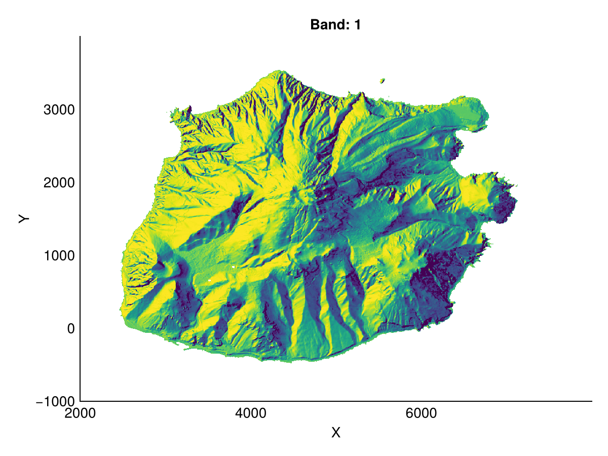{width=600px height=450px}

== GeoArrays (projected)

```julia
r = GeoArrays.read("saba.tif")
Geomorphometry.cellsize(r)
```


```ansi
(5.0, -5.0)
```


```julia
heatmap(multihillshade(r))
```

{width=600px height=450px}

== Rasters (geographic)

```julia
r = Raster("Copernicus_DSM_10_N52_00_E004_00_DEM.tif")
Geomorphometry.cellsize(r)
```


```ansi
(28.15512714621766, -30.83333333333341)
```


```julia
heatmap(multihillshade(r))
```

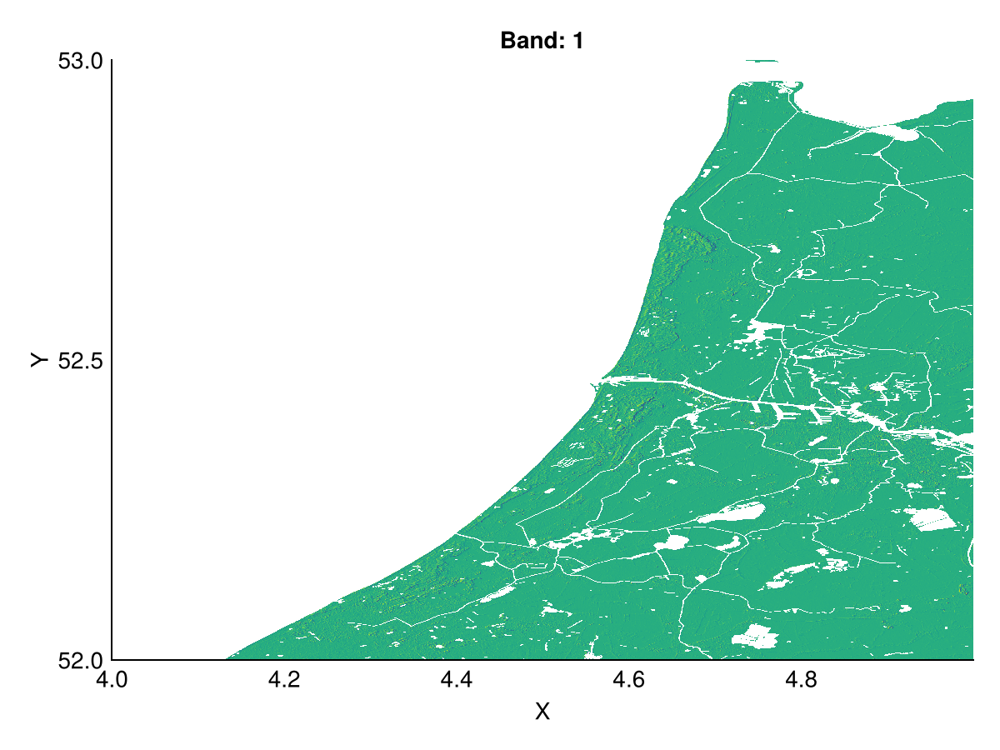{width=600px height=450px}

== GeoArrays (geographic)

```julia
r = GeoArrays.read("Copernicus_DSM_10_N52_00_E004_00_DEM.tif")
Geomorphometry.cellsize(r)
```


```ansi
(28.155038200616524, -30.833333333333332)
```


```julia
heatmap(multihillshade(r))
```

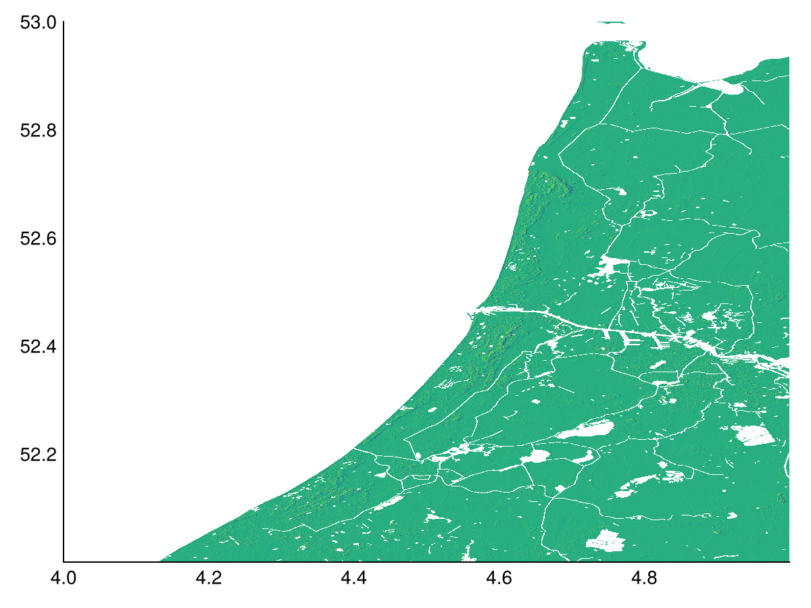{width=600px height=450px}

:::

## Multiple algorithms {#Multiple-algorithms}

We have implemented several algorithms for a common operation so that you can choose the one that best fits your needs. For example, the `slope` function has three methods: `Horn`, `ZevenbergenThorne`, and `MaximumDownwardGradient`, as shown in the [Usage](usage.md) section.

Sometimes, as is the case for the `FD8` algorithm, these methods take different parameters that influence the results. `FD8` takes a `p` parameter that is used to weigh the flow direction, with higher powers resulting in less divergent flows (and thus more like D8).

:::tabs

== FD8 with power of 1

```julia
acc, ldd = flowaccumulation(dtm; method=FD8(1))
heatmap(log10.(acc); colormap=:rain)
```

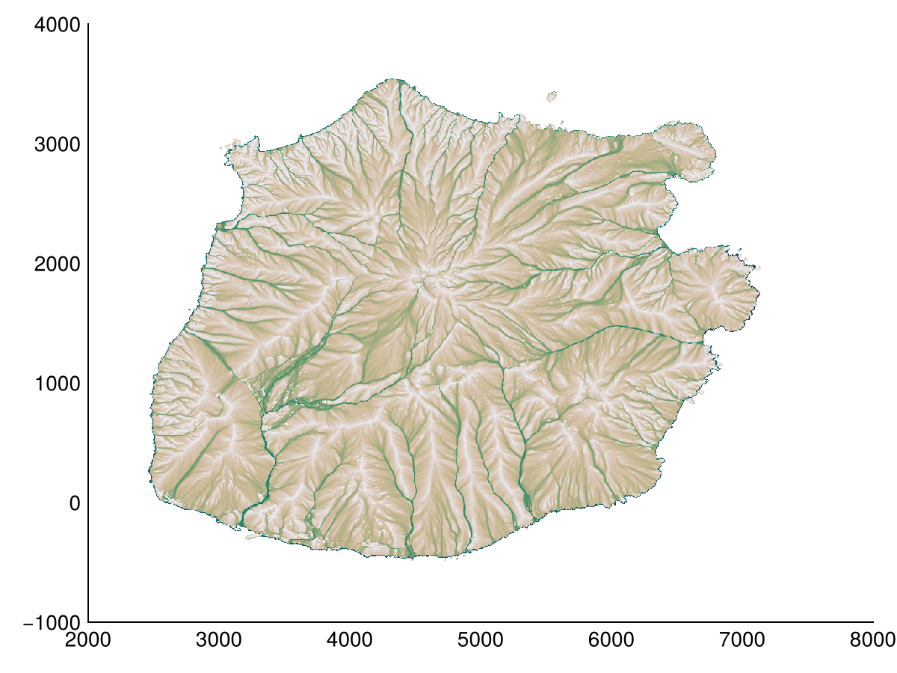{width=600px height=450px}

== FD8 with power of 2

```julia
acc, ldd = flowaccumulation(dtm; method=FD8(2))
heatmap(log10.(acc); colormap=:rain)
```

{width=600px height=450px}

== FD8 with power of 5

```julia
acc, ldd = flowaccumulation(dtm; method=FD8(5))
heatmap(log10.(acc); colormap=:rain)
```

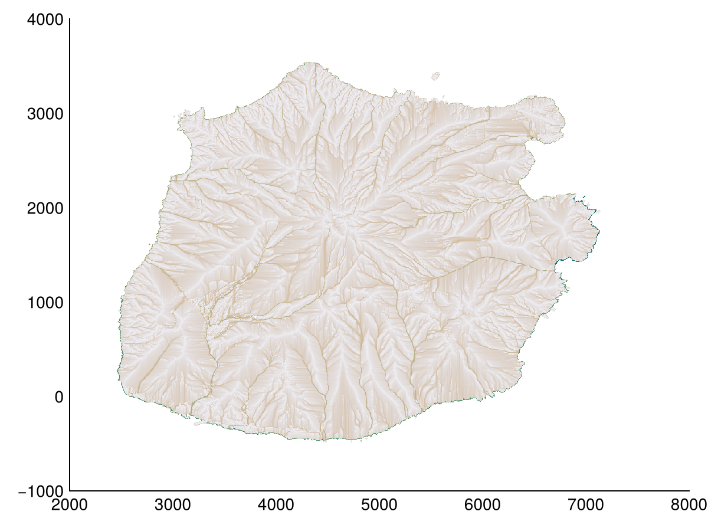{width=600px height=450px}

== D8 (single flow direction)

```julia
acc, ldd = flowaccumulation(dtm; method=D8())
heatmap(log10.(acc); colormap=:rain)
```

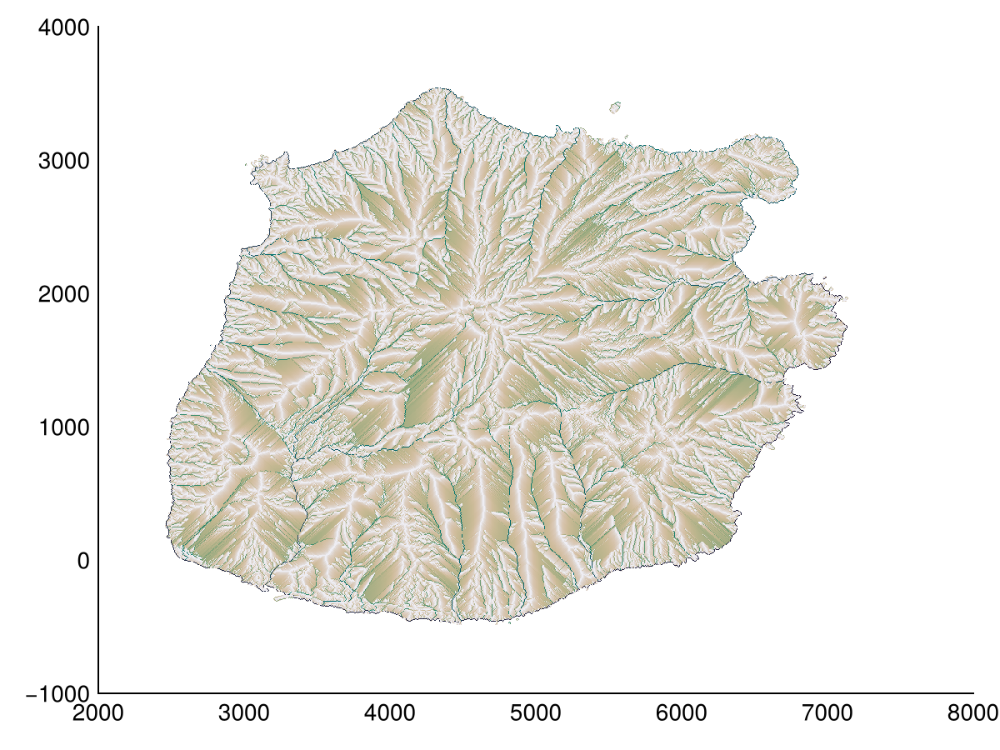{width=600px height=450px}

:::

## Multiple scales {#Multiple-scales}

Inspired by the excellent [MultiScaleDTM](https://github.com/ailich/MultiscaleDTM) package in R by [Ilich _et al._ (2023)](/bibliography#ilichMultiscaleDTMOpensourcePackage2023), we have added multiscale options to some filters.

Relative terrain filters have a `window` keyword argument for a Stencil from [Stencils.jl](https://github.com/rafaqz/Stencils.jl) package.

:::tabs

== Square window of 1

```julia
Geomorphometry.Moore(1)
```


```ansi
Stencils.Moore{1, 2, 8, Nothing}
█▀█
▀▀▀

```


```julia
heatmap(TPI(dtm, Geomorphometry.Moore(1)); colorrange=(0,25), colormap=:speed)
```

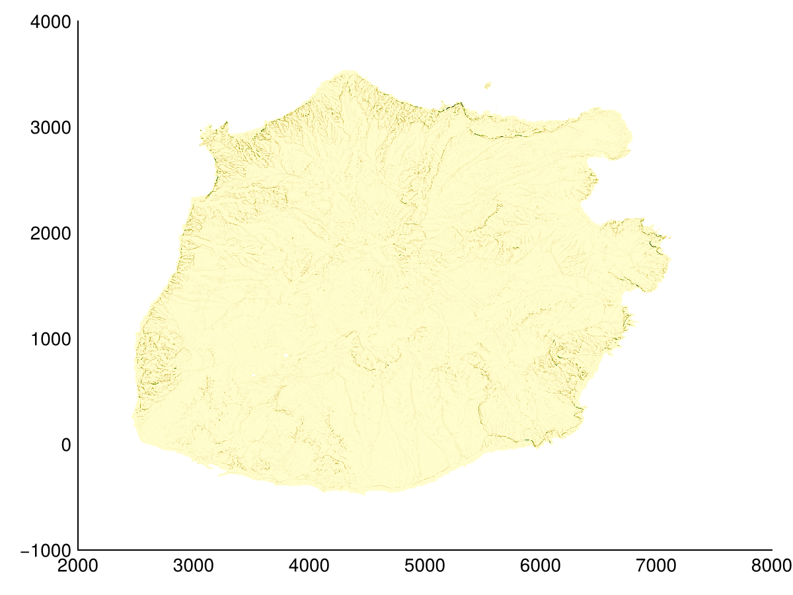{width=600px height=450px}

== Square window of 3

```julia
Geomorphometry.Moore(3)
```


```ansi
Stencils.Moore{3, 2, 48, Nothing}
███████
███▀███
███████
▀▀▀▀▀▀▀

```


```julia
heatmap(TPI(dtm, Geomorphometry.Moore(3)); colorrange=(0,25), colormap=:speed)
```

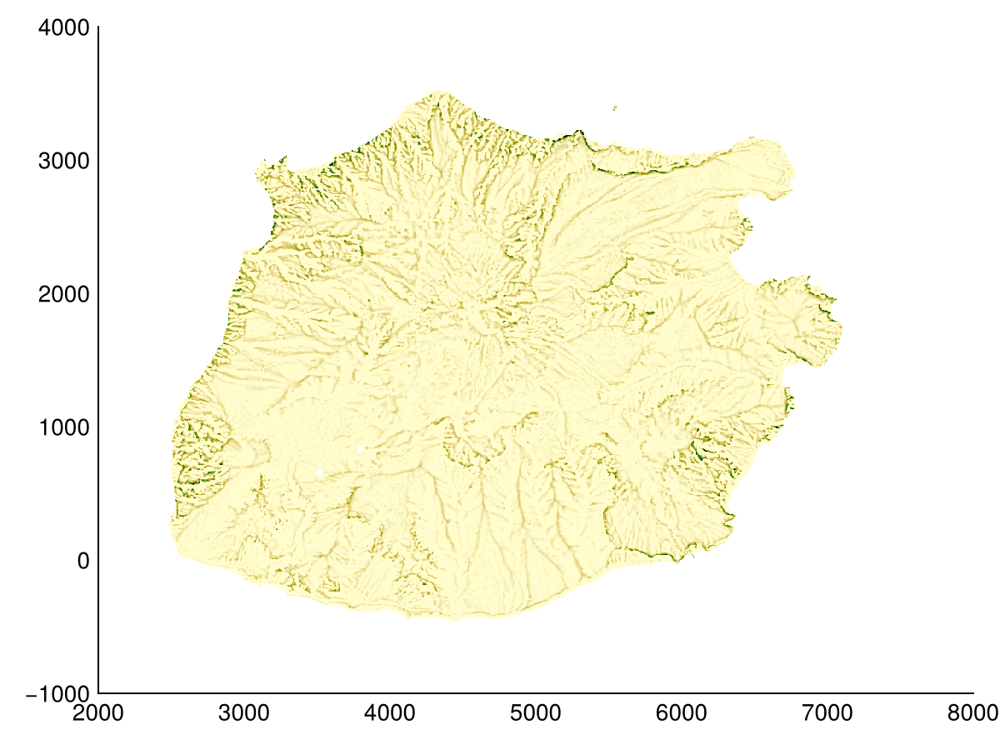{width=600px height=450px}

== Square window of 5

```julia
Geomorphometry.Moore(5)
```


```ansi
Stencils.Moore{5, 2, 120, Nothing}
███████████
███████████
█████▀█████
███████████
███████████
▀▀▀▀▀▀▀▀▀▀▀

```


```julia
heatmap(TPI(dtm, Geomorphometry.Moore(5)); colorrange=(0,25), colormap=:speed)
```

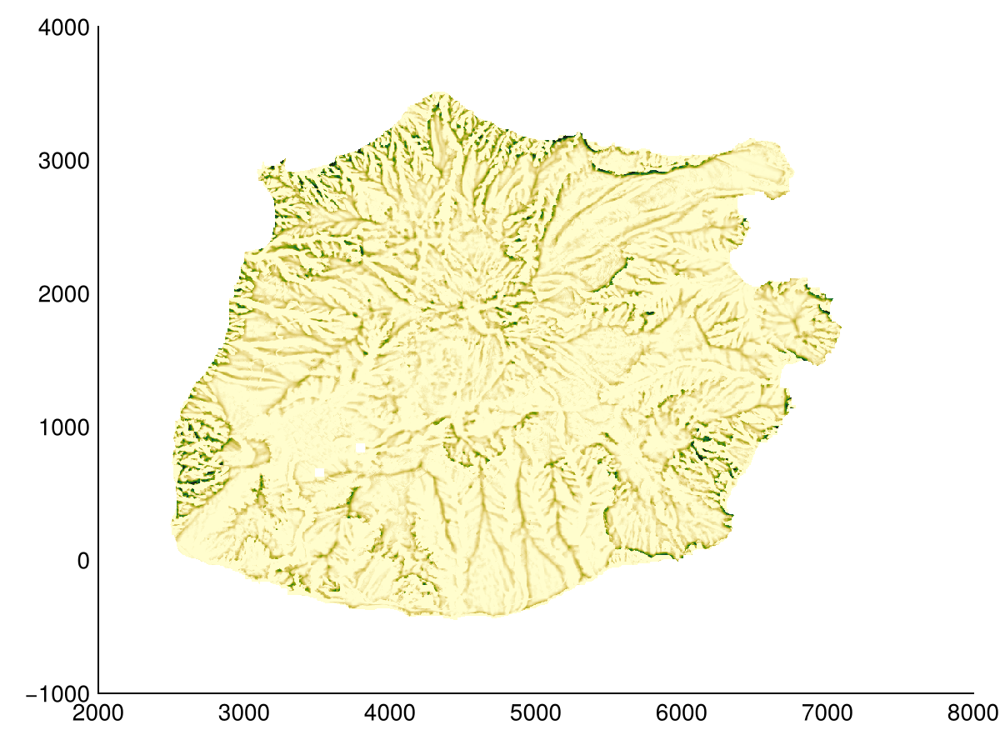{width=600px height=450px}

:::

Other methods that require a specific type of window now take a `radius` kwarg, scaling said window.

:::tabs

== Radius of 1

```julia
Geomorphometry.scaled8nb(1)
```


```ansi
Stencils.NamedStencil{(:Z1, :Z2, :Z3, :Z4, :Z5, :Z6, :Z7, :Z8, :Z9), ((-1, -1), (0, -1), (1, -1), (-1, 0), (0, 0), (1, 0), (-1, 1), (0, 1), (1, 1)), 1, 2, 9, Nothing}
███
▀▀▀

```


```julia
heatmap(profile_curvature(dtm, radius=1); colorrange=(-1,1), colormap=:tarn)
```

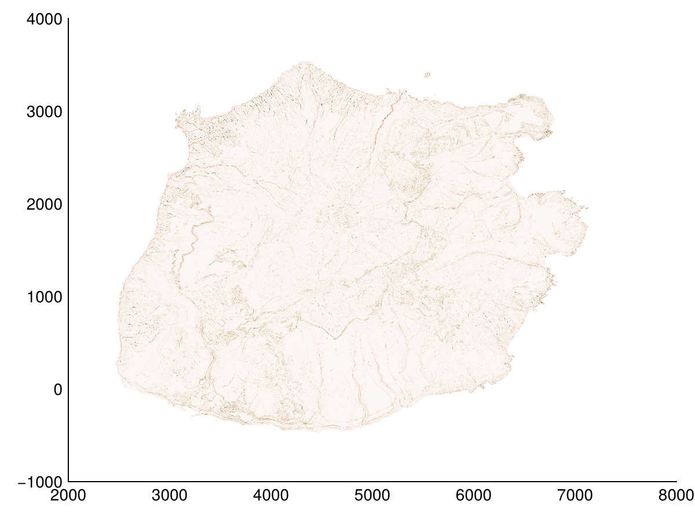{width=600px height=450px}

== Radius of 3

```julia
Geomorphometry.scaled8nb(3)
```


```ansi
Stencils.NamedStencil{(:Z1, :Z2, :Z3, :Z4, :Z5, :Z6, :Z7, :Z8, :Z9), ((-3, -3), (0, -3), (3, -3), (-3, 0), (0, 0), (3, 0), (-3, 3), (0, 3), (3, 3)), 3, 2, 9, Nothing}
▀  ▀  ▀
▄  ▄  ▄
       
▀  ▀  ▀

```


```julia
heatmap(profile_curvature(dtm, radius=3); colorrange=(-1,1), colormap=:tarn)
```

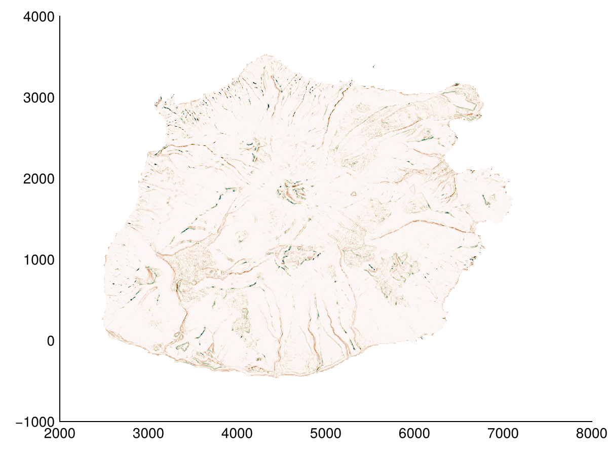{width=600px height=450px}

== Radius of 5

```julia
Geomorphometry.scaled8nb(5)
```


```ansi
Stencils.NamedStencil{(:Z1, :Z2, :Z3, :Z4, :Z5, :Z6, :Z7, :Z8, :Z9), ((-5, -5), (0, -5), (5, -5), (-5, 0), (0, 0), (5, 0), (-5, 5), (0, 5), (5, 5)), 5, 2, 9, Nothing}
▀    ▀    ▀
           
▄    ▄    ▄
           
           
▀    ▀    ▀

```


```julia
heatmap(profile_curvature(dtm, radius=5); colorrange=(-1,1), colormap=:tarn)
```

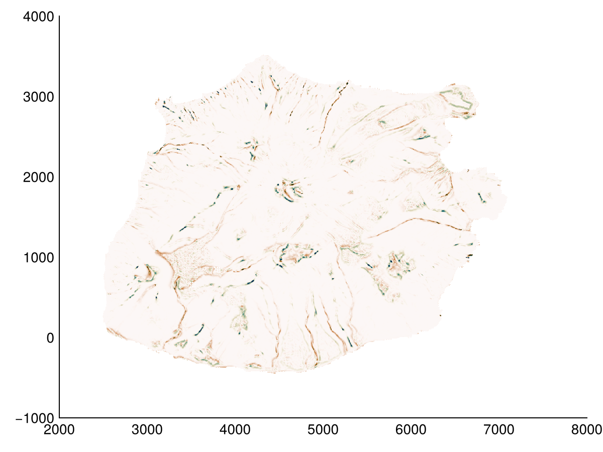{width=600px height=450px}

:::
